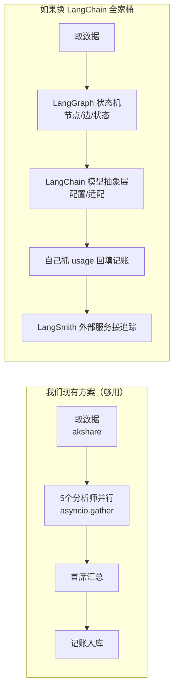

# 现有技术架构与 LangChain 全家桶对比报告

> 版本：v1.0
> 编写日期：2026-08-08
> 适用读者：项目负责人（技术小白）、开发者
> 配套文档：《系统架构设计说明书》《产品需求文档（PRD）》
> 一句话结论：**我们这个项目"多智能体"的复杂度，用 LangChain 是"开航母去菜市场"——不但不更合适，反而更难维护、更难控制成本和 AI 编数字的风险。**

---

## 1. 先用人话讲清楚几个专业名词

| 名词 | 通俗解释 |
|---|---|
| **LLM（大语言模型）** | 就是 DeepSeek、ChatGPT 这种"很会聊天、很会写文章"的 AI 大脑。你给它一段文字（问题），它回你一段文字（答案）。 |
| **API（接口）** | 程序之间打电话的方式。我们的程序通过 API 把问题发给 DeepSeek 的服务器，它算完再把答案传回来。 |
| **智能体 / Agent** | 一个"会自己拿工具干活"的 AI 角色。比如"资金分析师"这个角色，拿到资金数据后会自己说该买什么。注意：严格意义的 Agent 能自己决定调用哪个工具，我们项目里的"智能体"其实是被程序按固定步骤驱动的，更像"流水线工人"。 |
| **编排 / Orchestration** | 像乐队指挥，决定谁先拉、谁后敲、谁合奏。在我们的程序里就是"先 5 个分析师一起干，干完把结果交给首席汇总"。 |
| **并行 / 串行** | 并行 = 5 个人同时干活；串行 = 一个干完下一个才干。我们分析师是并行（省钱省时间），首席汇总在后面是串行。 |
| **Fan-out / Fan-in** | 一件事拆成多份同时做（fan-out 扇出），再把多份结果合回来（fan-in 扇入）。这是本项目唯一的 AI 编排模式。 |
| **状态机 / State Machine** | 一种更复杂的编排方式：把流程画成一张"流程图"，每一步是一个"状态"，状态之间可以转圈、回头、条件分叉。LangGraph 就是干这个的。 |
| **工具调用 / Function Calling** | 让 AI 自己决定"要不要调数据接口、调几次"。我们项目**没有用**这个——数据是我们程序先取好、塞进 prompt 里的，AI 只负责解读，不准自己拿数据。 |
| **RAG（检索增强生成）** | 先从一堆文档里"搜"出相关片段，再喂给 AI，让它有依据地回答。我们项目**不用 RAG**——数据来自 akshare 实时接口，不是文档库。 |
| **向量数据库** | 专门存"语义相似度"的库，是 RAG 的必备零件。我们项目没用。 |
| **可观测性 / Observability** | 出了问题能不能查到原因。我们的方式是：每次调 LLM 都记一笔 token 和费用到数据库，定时任务写日志。 |
| **依赖 / 依赖管理** | 你的项目一共要装多少个第三方包。包越多，升级时越容易出一个崩一个。 |
| **抽象 / 封装** | 把底层细节藏起来，给你一层"好用的接口"。好处是省事，坏处是出问题时你看不到细节、改不了底层。 |

---

## 2. 我们项目现在是怎么跑 AI 的（现有架构）

### 2.1 一张表看清现状

| 层 | 用了什么 | 怎么实现 |
|---|---|---|
| LLM 调用 | DeepSeek API | 裸 `httpx` 库直接发 HTTP 请求，要求返回 JSON（`response_format: json_object`）|
| 编排逻辑 | 手写 Python | `asyncio.gather`（并行）+ 一个汇总函数（串行）|
| 数据获取 | akshare | 程序先取数据，塞进 prompt 文字里 |
| 成本记账 | 自建表 `llm_usage`| 每次调用记 token 数 + 算成钱（分），存进 PostgreSQL |
| 测试 | pytest + respx | respx 专门"假装"DeepSeek 的 API 返回，方便测 |
| 一致性保护 | `{{ANALYST_KEY:xxx}}` 标记 | mock 模式靠这个标记从本地假数据库里挑对应的假答案 |

### 2.2 四个分析流程的真实结构

1. **个股分析 `analysis_orchestrator.py`**：取数据 → 计算 K 线指标 → 5 个分析师**并行**（技术/基本面/资金/新闻/情绪）→ 首席分析师**汇总**出"买入/持有/卖出"决策。
2. **主力掘金 `main_force_orchestrator.py`**：取候选股 → 量化规则筛选过滤 → 5 个分析师**并行**（资金/行业/基本面/技术/量化）→ 研究员**汇总**出建仓清单 + 排除名单。
3. **板块分析 `sector_orchestrator.py`**：取指数和板块行情 → 4 个智能体**并行**（宏观/诊断/资金/情绪）→ 首席**汇总**出多空预测。
4. **龙虎榜分析 `dragon_tiger_orchestrator.py`**：取龙虎榜席位数据 → 量化规则算排行 → 1 个游资行为分析师直接出结论。这条线连"并行"都不需要，是最简单的一种。

> 通俗类比：前三条线都是**"开会"**模式——先把背景资料发给大家，各位专家**同时**写自己的报告，最后主持人把所有报告收齐做总结。第四条线更简单，是**"一个专家看报告"**模式。这两类都是最简单的一类"多智能体"，叫 **fan-out → fan-in**。

### 2.3 现有架构的两个关键设计纪律

- **数据与 AI 分离**：数字一律由程序从 akshare 取好再塞给 AI，AI 只解读不准编。这条是防"AI 胡说八道数字"的命门（见《系统架构设计说明书》1.2 节）。
- **成本可控**：每次调 LLM 都记账，DeepSeek 按 token 计费，能精确到每模块每用户花了多少分钱。

---

## 3. LangChain 全家桶是什么

LangChain 是 AI 应用领域最火的一套开源工具库，"全家桶"通常指三件套：

| 组件 | 作用 | 通俗类比 |
|---|---|---|
| **LangChain（核心库）** | 把"调 LLM""拼 prompt""接数据源""做工具调用"等常用操作封装成一行代码的接口 | 像一个"AI 应用零件箱" |
| **LangGraph** | 用状态机管理多步骤、会循环、会分叉的复杂 AI 流程 | 像"电机控制柜"，能画流程图、能让步骤回头重来 |
| **LangSmith** | 记录每次 LLM 调用的全过程、可视化追踪每一步 | 像"行车记录仪 + 监控大屏"|

这三件套在**做"会自己拿工具、会循环试错、会反思纠错"的复杂 Agent**时确实很强。很多教程一讲 multi-agent 就推 LangChain，所以会有"多智能体就该用 LangChain"的印象。

---

## 4. 逐项对比

| 对比维度 | 我们现有（裸 Python + httpx）| LangChain 全家桶 | 对本项目影响 |
|---|---|---|---|
| **调 LLM** | 一段 40 行的 `chat()` 函数，透明可见 | 一行 `ChatOpenAI().invoke()`，但要把 DeepSeek 配成 OpenAI 兼容、设 `response_format`、塞回我们的记账 | 现有更省事 |
| **编排（分析师并行 → 汇总）** | `asyncio.gather` 几行搞定 | 要学 LangGraph 的 StateGraph/节点/边，写同样的事 | 现有更轻 |
| **数据 → AI 分离纪律** | 程序取好数据塞 prompt，硬编码 | 没有内建的"禁止 AI 取数据"机制 | 现有更符合我们合规要求 |
| **成本记账** | 直接拿 token usage 落库，精确到分 | 抽象层可能不暴露原版 usage，要"绕回去"自己抓 | 现有更可控 |
| **测试** | respx mock 网络层，简单直接 | 要 mock LangChain 的抽象对象，路更绕 | 现有更好测 |
| **依赖体积** | `requirements.txt` 已铺满，无重型 AI 框架 | LangChain + LangGraph + LangSmith 一大坨依赖 | 现有更轻 |
| **单机部署/维护** | 一个人 + 一个 Docker Compose | 多一层会升级会坏的框架 | 现有更省心 |
| **遇到 DeepSeek 改接口/改计费** | 改我们一个函数就行 | 可能要先等 LangChain 出补丁 | 现有更敏捷 |
| **如果要做"会调工具、会循环反思的复杂 Agent"** | 要自己写循环和工具注册，会变啰嗦 | 天生就支持，省事 | **这里才是 LangChain 的主场** |
| **如果要接向量库做 RAG** | 要自己接 pgvector / chroma | 一行接好 | LangChain 更省事 |
| **对"技术小白项目负责人"的可读性** | 代码少、名词少、能看懂 | 多一层框架概念 | 现有更友好 |

### 对比图

---

## 5. 为什么本项目不需要 LangChain（详细理由）

我们有 6 条具体理由，每条都能在现有代码里找到证据：

1. **编排模式太简单，杀鸡用牛刀**。我们四条流水线里三条是"并行 + 汇总"两步（龙虎榜那条甚至只有一步），`asyncio.gather` 已是教科书级写法（见 `analysis_orchestrator.py:run_full_analysis`、`sector_orchestrator.py:run_sector_analysis`）。引入状态机式 LangGraph 反而要学一套新概念，干的还是同一件事。

2. **合规纪律要求"AI 不准自己取数据"**。LangChain/Agent 最强的卖点是"AI 自己挑工具调接口"，但这恰好是我们架构要**主动禁止**的（架构设计书 1.2"数据与 AI 分离"）。引入工具调用能力反而增加"AI 自己瞎调接口编数字"的风险。

3. **成本记账是硬需求，抽象层拖后腿**。我们每次调用都把原始 `prompt_tokens / completion_tokens` 落库算钱（见 `core/llm.py:_log_usage`）。LangChain 的模型抽象会吞掉或改写这些原始字段，要"逆向"抓回来，得不偿失。

4. **DeepSeek 兼容性自己掌控最快**。DeepSeek 是 OpenAI 兼容 API，但有自己的 quirks（如 `response_format: json_object` 必须显式指定、不支持某些参数）。裸 `httpx` 我们想怎么发就怎么发；用 LangChain 的 `ChatOpenAI` 反而要绕过它写的约束。

5. **单机单维护者，依赖越少越稳**。我们 Docker Compose 单机部署、一个人维护（架构设计书 1.1"一名开发者可维护"）。LangChain 全家桶依赖树庞大，一次框架升级就可能带动一堆破坏性变更，对单人维护是负担。

6. **YAGNI 原则**（You Aren't Gonna Need It，没需求不提前做）。我们项目功能里既没有 RAG 文档检索，也没有"AI 反思+循环纠错"，更没有"AI 动态选工具"。这三样都是 LangChain 的核心价值，但我们**当前和可预见的 M1-M7 路线都不需要**。提前引入等于背上自己用不到的复杂度。

---

## 6. 什么情况下值得重新考虑引入 LangChain

不是永远不用，而是"现在不该用"。下面任一条真正出现在需求里时，再评估：

| 触发场景 | 为什么这时 LangChain 更合适 |
|---|---|
| 要做"AI 反复试错、自我纠错"的深度推理流程 | 需要循环/条件分支，手写状态机会很啰嗦 |
| 要接向量数据库做研报/公告的 RAG 检索问答 | LangChain 的向量库连接器省事 |
| 要支持多家 LLM 厂商随时切换 | LangChain 的模型抽象层有用 |
| 要做开放式工具调用（AI 自己选调哪个接口）| 这正是 LangChain/LangGraph 的主场 |
| 团队变多人、愿意为"可观测性"接 LangSmith | 多人协作 + 专业追踪有价值 |

> 即便到那时，也不是"全家桶一起上"，而是**按需单点引入**：要循环就只上 LangGraph，要 RAG 就只用它的向量库连接器，记账依然自己掌控。一句话：**别为了"全家桶"而"全家桶"，用到哪件才拿哪件。**

---

## 7. 给技术小白的一页总结

- **"多智能体用 LangChain 最合适"是个半真半假的说法。** 它适合的是"会自己找工具、会循环纠错"的复杂智能体；我们这种"几个专家并行写报告再汇总"的简单模式，Python 自己几行代码就写得清清楚楚。
- **我们现在的做法不是"土"，而是"精准克制"**：把数据攥在程序手里、把 AI 当解读器、把每一分钱都记进账，这三点对投资类系统比任何花哨框架都重要。
- **换框架是有成本的**：要学新概念、要装更多依赖、要改测试、要时刻跟着框架升级。在没产生真需求前换，就是把简单的事变复杂。
- **结论**：维持现有"裸 Python + httpx + asyncio"架构。等未来真出现"AI 反思循环""研报 RAG 问答"这类需求时，再单点评估引入对应组件。
