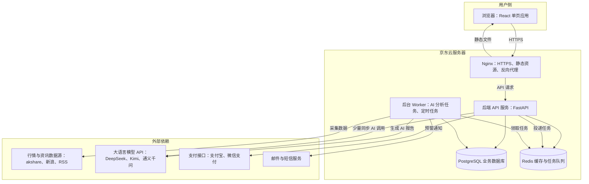
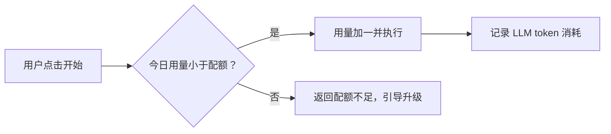
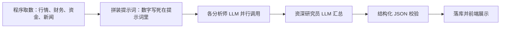
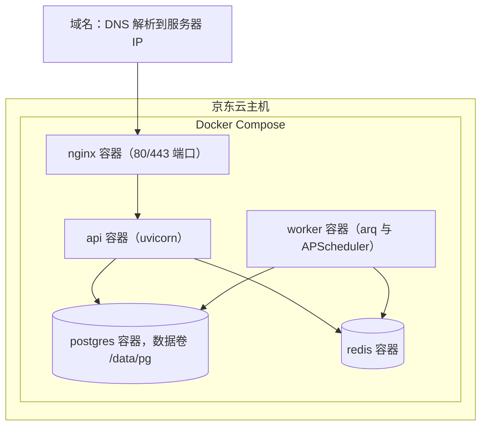

# 睿见投研（A 股 AI 投研系统）系统架构设计说明书

> 版本：v1.0
> 编写日期：2026-08-07
> 配套文档：《系统详细功能介绍》《产品需求文档（PRD）》《系统开发实施计划及指导手册》
> 说明：本文档是基于对参照系统（https://aistock.rongqitech.cn/）的实际使用、接口抓包和功能反推，为我们的复刻项目所做的架构设计。文中标注"实测"的内容来自对参照系统的真实观察；标注"设计"的内容是我们自己的方案决策。

---

## 1. 设计目标与原则

### 1.1 设计目标

1. 用一套**单服务器可承载**的架构，支撑 PRD 中 M1-M7 的全部功能；
2. AI 分析类重任务**异步化**，页面永不卡死；
3. LLM（大语言模型）调用**成本可控**（配额 + 用量记账）；
4. 数据源可替换（免费源失效时能切换备用源）；
5. 一名开发者（借助 AI 编程助手）可维护。

### 1.2 设计原则

| 原则 | 说明 |
|---|---|
| 简单优先 | 单机、单库、单进程起步，不引入微服务 |
| 异步解耦 | AI 分析走后台任务队列，前端轮询结果 |
| 数据与 AI 分离 | 数字一律由程序从数据源注入，LLM 只负责解读，防止"AI 编数字" |
| 一切可观测 | LLM 每次调用记录 Token 用量；定时任务记录日志；接口有访问日志 |
| 合规内建 | 免责声明、配额限制、不碰代客理财 |

---

## 2. 总体架构

### 2.1 架构总览图



### 2.2 一段话理解架构

用户在浏览器里打开我们的网站（一个 React 写的单页应用），所有数据请求都发到京东云服务器上的 Nginx；Nginx 把 `/api/` 开头的请求转给 FastAPI 后端。后端负责登录鉴权、查数据库、返回数据。凡是"要调 AI、要跑几分钟"的活（比如 6 位分析师写报告），后端不当场做，而是写一张"工单"扔进 Redis 队列，由后台 Worker 慢慢做，做完存进数据库；前端每隔几秒问一次"做好了吗"，做好了就展示。每天凌晨的定时任务（板块分析、美股研报、新闻采集）也由 Worker 按点执行。

### 2.3 名词解释（本架构涉及的核心术语）

| 名词 | 通俗解释 |
|---|---|
| SPA（单页应用） | 整个网站其实是一个网页，切换"页面"只是前端换内容，不整页刷新，体验像 App |
| Nginx | 服务器的"门卫兼前台"：负责 HTTPS 加密、把请求分发给正确的内部服务 |
| FastAPI | Python 的 Web 框架，用来写后端接口，性能好、自动生接口文档 |
| PostgreSQL | 主流开源关系型数据库，存用户、持仓、报告等结构化数据 |
| Redis | 内存级高速数据库，这里做两件事：缓存热点数据、当任务队列的"工单箱" |
| 任务队列（Queue） | "工单系统"：慢活不现场干，先登记，后台工人（Worker）按顺序干 |
| Worker | 后台工作进程，专门执行 AI 分析、数据采集、定时任务 |
| LLM | 大语言模型（如 DeepSeek），系统的"AI 分析师"大脑 |
| Token | 两种含义注意区分：① 登录令牌（通行证）；② LLM 计费单位（约 1 个汉字 ≈ 1-2 个 token） |
| Docker / Docker Compose | 把应用和它的运行环境打包成"集装箱"，一条命令在服务器上启动整套系统 |

---

## 3. 技术选型

| 层 | 选型 | 理由 |
|---|---|---|
| 前端框架 | React 18 + Vite | 参照系统实测即 React SPA；生态最大，AI 编程助手最熟 |
| 前端样式 | Tailwind CSS | 参照系统实测使用 Tailwind（页面 class 可见）；开发快 |
| 前端图表 | ECharts | K 线、热力图、指标面板都靠它，中文文档好 |
| 前端状态/请求 | TanStack Query（React Query） | 自动缓存、轮询任务结果很方便 |
| 后端框架 | Python 3.12 + FastAPI | 数据源库 akshare 是 Python 的，后端必须用 Python 才顺 |
| ORM | SQLAlchemy 2.0 + Alembic | 用 Python 类操作数据库；Alembic 管表结构变更 |
| 数据库 | PostgreSQL 16 | 生产级、免费；Docker 一键起 |
| 缓存/队列 | Redis 7 + arq（或 RQ） | arq 是 FastAPI 生态的异步任务队列，轻量够用 |
| 定时任务 | APScheduler（跑在 Worker 进程内） | 比 crontab 可控，任务状态可落库、可追踪 |
| LLM | DeepSeek、Kimi、通义千问 | 由管理员配置中心选择并验证；统一服务负责结构化调用、额度和审计 |
| 行情数据 | akshare 为主 + 新浪/东财接口备用 | 免费；PRD 数据需求全部覆盖 |
| 新闻采集 | RSS 解析（feedparser）+ 少量爬虫 | 参照系统实测来源：雪球、同花顺、新浪、央视等 |
| 支付 | 支付宝当面付/电脑网站支付 + 微信支付 Native | 个人开发者可接入；M6 阶段才需要 |
| 部署 | Docker Compose + Nginx + Let's Encrypt 证书 | 单机标准姿势 |
| 测试 | pytest（后端）+ Playwright（端到端） | 与团队现有习惯一致 |

> **为什么后端不用 Node.js？** 因为核心数据源 akshare 是 Python 库，后端用 Python 可以直接调用，省去"Node 调 Python"的别扭结构。

---

## 4. 前端架构设计

### 4.1 路由结构（与参照系统一致）

| 路由 | 页面 | 说明 |
|---|---|---|
| `/login` | 登录/注册 | 密码登录 + 邮箱验证码注册；忘记密码 |
| `/` | 首页 | 市场概览 + 大盘云图 |
| `/analysis` | 股票分析 | 单股/批量/历史 三个子标签 |
| `/main-force` | 主力选股 | 选股分析/历史记录 |
| `/sector` | 智策板块 | 板块分析/分析历史 |
| `/dragon-tiger` | 智瞰龙虎榜 | 实时分析/历史报告/数据统计 |
| `/portfolio` | 持仓分析 | 我的持仓/分析历史 |
| `/realtime` | 实时监测 | 监测管理/通知管理/交易计划/AI决策 |
| `/risk-warning` | 风险预警 | 风险分析/活跃预警/投资组合风险 |
| `/news` | 实时新闻 | 按时间/来源筛选 |
| `/us-research` | 美股隔夜研报 | 每日自动生成 |
| `/profile` | 个人中心 | 资料修改、密码修改 |
| `/recharge` | 充值中心 | 套餐矩阵、发起支付 |

### 4.2 前端分层

```
src/
├── api/          # 所有后端请求集中在这里（axios 封装，自动带登录令牌）
├── pages/        # 一个路由一个目录
├── components/   # 通用组件：布局、侧边栏、卡片、表格、图表封装
├── stores/       # 全局状态：当前用户、会员等级（zustand）
├── hooks/        # 复用逻辑：轮询任务结果、配额查询
└── utils/        # 格式化数字、涨跌幅颜色等
```

### 4.3 关键前端机制

1. **登录态**：登录成功把 JWT 令牌存 localStorage（与参照系统一致）；axios 拦截器自动在请求头带 `Authorization: Bearer <token>`；401 时自动用 refresh token 换新，失败则跳登录页。
2. **异步任务轮询**：AI 分析提交后拿到 `task_id`，用 React Query 每 3 秒查一次任务状态，直到 `success` 后渲染报告。
3. **会员配额**：每个"开始分析"按钮点击前先查配额接口，不足则弹升级引导。
4. **报告渲染**：AI 报告为结构化 JSON（结论表 + 各小节 markdown 文本），前端按模块渲染，不把整段 HTML 直接塞页面（防 XSS）。

---

## 5. 后端架构设计

### 5.1 分层结构

```
app/
├── api/            # 接口层：路由、参数校验、鉴权（每个模块一个文件）
├── services/       # 业务层：配额检查、组合计算、报告落库
├── agents/         # AI 引擎层：各"AI 分析师"的提示词与编排
├── datasource/     # 数据采集层：akshare/新闻/美股的统一封装（可替换源）
├── tasks/          # 任务层：异步任务 + 定时任务定义
├── models/         # 数据库表定义（SQLAlchemy）
├── schemas/        # 接口出入参定义（Pydantic）
├── core/           # 配置、日志、鉴权工具与 LLM 兼容导入 facade
└── main.py         # FastAPI 入口
```

**分层的意义**：接口层只负责"收发"，业务层负责"规矩"，AI 层负责"动脑"，数据层负责"取数"。以后换数据源只改 `datasource/`，换模型只改配置中心和统一调用服务，互不影响。

### 5.2 鉴权与权限

- 注册：用户名 + 邮箱 + 密码 + 邮箱验证码（验证码存 Redis，5 分钟有效）；
- 密码用 bcrypt 哈希存储，绝不存明文；
- 登录颁发双令牌：access token（2 小时）+ refresh token（14 天）；
- 角色字段 `role`：`user` / `admin`（参照系统实测存在管理员专属功能，如"活跃预警"全局视图）；
- 会员等级字段 `tier`：`free / D / C / B / A`，决定功能开关与每日配额。

### 5.3 配额系统（成本控制核心）

每个 AI 功能定义"计量键"，如 `analysis.single`、`main_force.run`。每次调用前：



配额矩阵照抄 PRD 第 8 节（free 体验限次、D 档 5 次/日……A 档不限）。"不限"在代码里用 -1 表示（参照系统实测界面显示"剩余 -1 次"，就是这个含义）。

### 5.4 LLM 额度账本、任务锁与 outbox（可靠性边界）

大模型费用的唯一账本在 PostgreSQL，不在 Redis。一次调用先锁定北京时间当天的
`llm_daily_budgets` 行，写入 token reservation 和 `llm_call_attempts`，网络请求在事务
之外执行；收到响应后再用短事务结算实际 token/费用，释放或结清 reservation，并写入
`llm_usage`。因此 Redis 重启只会影响队列投递，不会重置已预留或已结算额度。价格快照
缺失时该分组和总额显示“价格未知”，不会把未知成本当成 0。

任务提交在同一短事务内锁定 `task_records` 对应的已验证模型配置快照，随后写入
`task_outbox`。Worker 使用行锁和 `SKIP LOCKED` 领取 outbox，固定
`job_id=task:{task_id}`，重复投递只执行一次逻辑任务。执行期间通过
`execution_token`（执行栅栏令牌）和 lease 心跳更新；旧 Worker 失去令牌后不能调用模型、
更新进度或提交报告。报告与 `task.status=success` 在同一事务提交；必要步骤失败时任务
进入 `failed` 或 `failed_unknown`，不生成空白报告，后者不自动重试。

---

## 6. AI 多智能体引擎设计（本系统的灵魂）

### 6.1 统一模式：数据注入 + 角色扮演 + 结构化输出

每个模块的 AI 报告都遵循同一条流水线：



**铁律**：报告里的所有数字（价格、涨跌幅、资金额）必须来自第 1 步程序取数，LLM 输出只做"解读、判断、建议"。这样即使模型幻觉，也不会报错数字。

### 6.2 各模块智能体配置

| 模块 | 智能体团队（实测） | 输入数据 | 输出 |
|---|---|---|---|
| 股票分析 | 6 位：技术面、基本面、资金面、新闻舆情、风险评估、综合策略分析师 | 行情+指标、财报、资金流、新闻 | 评级（买入/持有/卖出）、置信度、各维度报告 |
| 主力选股 | 5 位：资金流向、行业板块、财务基本面、技术形态、量化分析师 + 资深研究员汇总 | 全市场资金流排行、股东户数、财务 | 4 只左右推荐股：买入区间/卖出区间/信心值/仓位 |
| 智策板块 | 4 位：宏观策略师、板块诊断师、资金流向分析师、市场情绪解码员 | 申万板块行情/资金流、市场宽度 | 看多/看空/中性板块 + 置信度 + 轮动建议 + 热度榜 |
| 智瞰龙虎榜 | 1 位游资行为分析师（+规则评分引擎） | 近 N 天龙虎榜明细 | 推荐股 TOP10（评分/等级）、活跃游资画像、风险警告 |
| 持仓分析 | 组合诊断师 + 个股分析师 | 用户持仓 + 实时行情 | 组合健康评分、逐股目标价/止损价/仓位建议 |
| 风险预警 | 规则引擎为主 + AI 解读 | 波动率、RSI 等指标 | 分级预警（信息/警告/危险/严重） |
| 实时监测-AI决策 | 盯盘决策智能体 | 监测触发时的实时行情 | 买入/卖出/观望决策 + 理由 |
| 美股隔夜研报 | 1 位宏观研究员 | 美股指数、板块样本、美债收益率、英文新闻 | 八段式研报（核心结论→对 A 股映射→关注方向） |

### 6.3 提示词管理

- 每个智能体一个提示词文件（如 `agents/prompts/technical_analyst.md`），支持版本号；
- 提示词中用占位符注入数据：`{latest_price}`、`{ma20}` 等；
- 要求 LLM 输出精确 JSON，用版本化 Pydantic Schema 校验；校验失败只允许一次独立计费
  的 correction。第二次仍失败则向任务层传播稳定中文错误，不合成中性内容，也不保存最终报告。

### 6.4 成本与用量观测

实测参照系统一次主力选股消耗约 8.3 万 token（Prompt 58,390 + Completion 25,060）。设计对策：

1. 每次调用记录：模块、模型、prompt/completion token、耗时，落 `llm_usage` 表；
2. 系统级每日 token 总闸（如 200 万 token/日），超过即暂停非核心任务；
3. 智能体并行调用（asyncio.gather），把总耗时从"串行相加"压到"最慢的一个"。

### 6.5 模型配置与密钥轮换

管理员在“大模型中心”维护 DeepSeek、Kimi、通义千问的供应商、自由模型 ID、Base URL、
启停状态、验证结果和默认模型。API Key 只在提交测试或保存时短暂进入请求，数据库中以
AES-GCM 加密保存，日志、异常、页面和审计文本都只显示脱敏值。

密钥环采用“双读单写”：当前 `LLM_CONFIG_ENCRYPTION_KEY_ID` 只负责新写入；读取时按
配置记录中的 key ID 在整个 `LLM_CONFIG_ENCRYPTION_KEYS` 环中解密，因此轮换期间旧配置仍
可读。轮换步骤是先把新密钥加入密钥环并切换写入 ID，确认读取与健康检查通过后再在维护
窗口移除旧密钥。生产环境没有已配置密钥环时，bootstrap/readiness 会失败并保持流量关闭。

---

## 7. 数据库设计

### 7.1 核心表（主要字段）

| 表 | 用途 | 主要字段 |
|---|---|---|
| `users` | 用户 | id, username, email, password_hash, role, tier, tier_expire_at, created_at |
| `usage_logs` | 每日配额计数 | id, user_id, meter_key, used_date, count |
| `llm_usage` | LLM 账单 | id, user_id, module, model, prompt_tokens, completion_tokens, cost_fen, created_at |
| `analysis_reports` | 股票分析报告 | id, user_id, stock_code, rating, confidence, report_json, created_at |
| `main_force_runs` | 主力选股批次 | id, run_date, candidates, filtered, recommended_json, token_total |
| `sector_reports` | 板块分析（每日） | id, report_date, bull_json, bear_json, neutral_json, rotation_json, summary |
| `dragon_tiger_reports` | 龙虎榜报告 | id, period_days, stats_json, top_stocks_json, analysis_text, created_at |
| `portfolio_stocks` | 用户持仓 | id, user_id, stock_code, shares, cost_price, auto_monitor, created_at |
| `portfolio_reports` | 持仓诊断报告 | id, user_id, health_score, diagnosis_json, created_at |
| `monitor_configs` | AI 盯盘配置 | id, user_id, stock_code, entry_price, target_price, stop_price, interval_min, channels, ai_enabled, status |
| `monitor_notifications` | 监测通知 | id, config_id, user_id, type, title, content, status, created_at |
| `risk_warnings` | 风险预警 | id, user_id, stock_code, level, category, message, created_at |
| `news_items` | 新闻库 | id, source, title, content, url, sentiment, industries, published_at |
| `us_research_reports` | 美股研报 | id, trade_date, report_json, generated_at |
| `announcements` | 站内公告 | id, title, content, category, published_at |
| `feedbacks` | 用户反馈 | id, user_id, content, contact, status, created_at |
| `orders` | 充值订单（M6） | id, user_id, plan, amount_fen, channel, status, paid_at |
| `task_records` | 异步任务台账 | id, task_type, ref_id, status, progress, error, started_at, finished_at |

### 7.2 设计要点

- 报告类内容统一存 `JSONB`（PostgreSQL 的 JSON 字段），结构演进不用老改表；
- 所有表带 `created_at`；用户数据表带 `user_id` 并建索引；
- 每日定时任务报告（板块、美股研报）按日期唯一约束，重复执行覆盖更新；
- 新闻按 `url` 去重。

---

## 8. API 设计

### 8.1 设计规范

- 全部走 `/api/` 前缀；REST 风格；统一响应壳 `{code, message, data}`；
- 鉴权用 `Authorization: Bearer <token>`；
- 慢操作返回 `202 + task_id`，前端轮询 `GET /api/tasks/{task_id}`；
- 列表接口统一 `page / page_size` 分页（与参照系统实测一致）。

### 8.2 接口清单（实测 = 抓包所见；设计 = 我们补齐）

| 模块 | 接口 | 方法 | 来源 |
|---|---|---|---|
| 认证 | `/api/auth/register` `/login` `/refresh` `/me` `/send-verification-code` `/forgot-password` `/reset-password` | POST/GET | 实测（参照系统） |
| 公告 | `/api/announcements` | GET | 实测 |
| 反馈 | `/api/feedback` | POST | 实测（参照系统） |
| 首页 | `/api/stocks/market-indices` `/api/stocks/market-map` `/api/stocks/sectors/categories` `/api/stocks/sectors/overview` | GET | 实测 |
| 个股 | `/api/stocks/{code}/info` `/api/stocks/stocks/{code}/chart` | GET | 实测 |
| 股票分析 | `/api/stocks/analyze`（提交） `/api/stocks/user/results`（历史） | POST/GET | 实测 |
| 持仓 | `/api/stocks/portfolio/stocks` `/summary` `/history` `/analyze` | GET/POST | 实测（前三）+ 设计 |
| 实时监测 | `/api/stocks/ai-monitoring/configurations` `/notifications` | GET/POST/PATCH | 实测（查询）+ 设计（增改） |
| 主力选股 | `/api/stocks/main-force/run` `/history` | POST/GET | 设计 |
| 智策板块 | `/api/stocks/sectors/analyze` `/reports/latest` `/reports/history` | POST/GET | 设计 |
| 龙虎榜 | `/api/stocks/dragon-tiger/analyze` `/reports` `/stats` | POST/GET | 设计 |
| 风险预警 | `/api/stocks/risk/analyze` `/active` `/portfolio` | POST/GET | 设计 |
| 新闻 | `/api/stocks/news-feed/latest` `/sources` | GET | 实测 |
| 美股研报 | `/api/stocks/us-research/latest` `/regenerate` | GET/POST | 设计 |
| 配额 | `/api/billing/quota` `/plans` `/orders` `/pay-callback` | GET/POST | 设计（M6） |
| 任务 | `/api/tasks/{task_id}` | GET | 设计 |

> 命名体会：参照系统把业务接口都挂在 `/api/stocks/` 下，说明它的后端以"股票"为聚合根。我们可以照此习惯，保持 1:1 对照时更好查。

---

## 9. 定时任务与异步任务设计

### 9.1 定时任务表（参照系统行为实测 + 推断）

| 任务 | 频率 | 说明 |
|---|---|---|
| 行情快照刷新 | 交易中每分钟 | 首页指数、监测用价（实测首页标注"数据每分钟更新"） |
| 新闻采集 | 每 10-30 分钟 | RSS/爬虫 → 去重 → 规则分类利好利空与相关行业（纯数据任务） |
| 智策板块分析 | 每交易日 09:30 前 | 4 智能体出报告（实测报告时间 09:53） |
| 美股隔夜研报 | 每日 03:30-04:00 | 实测生成时间 03:47；总结前一美股交易日 |
| 龙虎榜日更 | 每交易日 17:00 后 | 交易所 T+1 公布数据后采集 |
| 监测轮询 | 按用户配置的 5/10/30/60/120 分钟 | 触发→写通知→（可选）AI 决策→按渠道推送 |
| 数据备份 | 每日 02:00 | pg_dump 上传对象存储或异地 |
| 试用到期检查 | 每小时 | 到期降级为 free |

### 9.2 异步任务（用户触发）

股票分析、批量分析（最多 50 只，实测限制）、主力选股、持仓诊断、风险分析、龙虎榜分析——全部走"投递 → Worker 执行 → 落库 → 前端轮询"。任务台账 `task_records` 记录状态机：`pending → running → success / failed / failed_unknown`，失败带稳定错误码和中文信息；`failed_unknown` 不自动重试。

---

## 10. 部署架构（京东云）

### 10.1 部署图



### 10.2 要点

1. **服务器规格**：4 核 8G 起步（Worker 跑 akshare 采集 + LLM 编排吃内存）；系统盘 100G；
2. **域名与备案**：国内云服务器挂域名必须 ICP 备案，**这是最耗时环节（约 2-4 周），开工第一天就启动备案**；
3. **HTTPS**：Let's Encrypt 免费证书 + 自动续期（acme.sh）；
4. **发布流程**：本地 `git push` → GitHub Actions 构建镜像 → SSH 到服务器 `docker compose pull && up -d`；
5. **数据卷**：PostgreSQL 数据、日志都挂载到宿主机 `/data/`，容器重建不丢数据；
6. **备份**：每日 `pg_dump` + 保留 14 天；重要报告表可额外导出 JSON；
7. **监控**：`/api/health` 健康检查 + 任务失败日志告警（先简单发邮件即可）。

### 10.3 首次 bootstrap、readiness 与真实 smoke

生产 Compose 采用两阶段发布。第一阶段先停止旧的 Nginx、API 和 Worker，让流量
fail-closed（失败时保持关闭），启动 PostgreSQL/Redis，并只运行一次 `migrator` 完成
Alembic 到所有 heads。第二阶段用 `--no-deps` 启动 API，等待 `/api/health`，再执行
`python -m app.cli.llm_config readiness`：它会检查加密密钥环、每日额度行和至少一个
active + verified + 未删除的默认模型。随后从数据库查询最新 DeepSeek 配置，执行一次
真实 `live-smoke`；只有 API、readiness 和 smoke 全部成功，才启动 Worker 与 Nginx、恢复
流量。Kimi/通义千问首次尚未接入时记录 onboarding incomplete；设置
`LLM_STRICT_THREE_PROVIDER_SMOKE=true` 后，每次发布还必须分别对三家执行真实 smoke。

首次 bootstrap 只在模型中心为空时消费兼容环境变量
`DEEPSEEK_API_KEY`、`LLM_MODEL`、`LLM_BASE_URL`，并把密钥加密写入数据库；已有管理员
配置不会被环境变量覆盖。这三个变量只保留一个观察发布周期，后续删除另开任务。API
Key 不写日志、不进镜像、不进入前端；readiness 失败时不应通过假数据或空报告绕过。

### 10.4 维护窗口、备份与回滚

经用户明确授权后再做生产维护：先暂停 AI 任务创建并记录 pending/running 任务，备份
PostgreSQL 和 `deploy/.env` 到受控位置，停止旧 API/Worker，运行一次 migrator 并核对
`alembic current` 与全部 heads；再按 10.3 顺序启动 API、readiness、DeepSeek smoke、
Worker 和流量。迁移失败或 smoke 失败保持 fail-closed，不让旧 Nginx 在未验收 API 上
继续导流。需要回滚时保留备份和上一镜像，恢复数据库备份后用上一版本镜像重复
readiness；不得把新版本任务重放到旧 schema。生产回滚、Kimi/通义千问真实报告和三家
重启验证均属于需单独批准的操作，本地验收不代替它们。

### 10.5 90 天内部 payload 清理与恢复语义

Worker 每日北京时间 01:00 执行 `cleanup_llm_audit_payloads`。它按
`(created_at,id)` 固定顺序、每批最多 500 行，在短事务中只清空
`llm_call_attempts.result_json` 与可能含响应体的 `response_metadata_json`；保留 hash、
schema、状态、供应商/模型、token、费用和错误字段。只有任务已处于 success、failed 或
failed_unknown，且没有 pending/locked outbox、reserved reservation 或 live lease 的
尝试才可清理；89 天及以内保留，超过 90 天才满足时间条件。最终报告、模型配置版本、
管理员审计事件、用量与额度账本永久保留。清理可重复执行，第二次返回 0；清理后的任务
不再重放，人工恢复只能新建 task id。日志只记录影响行数、批次数和截止时间。

---

## 11. 安全设计

| 面 | 措施 |
|---|---|
| 传输 | 全站 HTTPS，HTTP 强制跳转 |
| 密码 | bcrypt 哈希；登录失败 5 次锁定 10 分钟 |
| 接口 | JWT 鉴权；按 `user_id` 隔离数据（用户只能查到自己的持仓/报告） |
| 注入 | ORM 参数化查询；Pydantic 校验所有入参 |
| XSS | 前端渲染 AI 内容走 markdown 白名单，不直接注入原始 HTML |
| 采集合规 | 采集外部数据限速、带 UA；我们自己的接口按 IP+用户限流 |
| 密钥 | LLM Key 通过管理员配置中心加密落库；加密密钥环、JWT 和支付密钥只放服务器 `.env`，不进 git |
| 合规 | 全站 AI 输出附免责声明；注册协议写明"工具属性，非投资建议" |

---

## 12. 性能与缓存设计

| 场景 | 策略 |
|---|---|
| 首页指数 | Redis 缓存 60 秒（与"每分钟更新"对齐） |
| 板块概览 K 线 | Redis 缓存 5 分钟，按 `category+period` 做键 |
| 每日报告（板块/美股） | 落库直读，不走 LLM，毫秒级打开 |
| 新闻列表 | 落库 + 分页；情绪标注在采集时完成，不实时调 LLM |
| AI 分析 | 异步任务；同一股票当日重复分析直接返回已有报告（实测参照系统历史记录按天去重） |

---

## 13. 关键风险与对策

| 风险 | 概率 | 对策 |
|---|---|---|
| akshare 接口失效 | 高 | 数据源层统一封装 + 备用源 + 采集失败告警 |
| LLM 费用失控 | 中 | 配额 + 每日 token 总闸 + 用量表日结 |
| LLM 输出不合规/幻觉 | 中 | 数字程序注入；输出 JSON 校验；免责声明 |
| 投顾合规 | 高 | 见 PRD 第 9 节；初期不公开收费推广 |
| 单机故障 | 中 | 每日备份 + Docker 一键重建 + 文档化恢复流程 |
| 备案周期长 | 确定 | 开工即办，期间用 IP+端口内测 |

---

## 14. 架构决策记录（ADR 摘要）

| # | 决策 | 备选 | 理由 |
|---|---|---|---|
| 1 | 后端 Python/FastAPI | Node.js | akshare 是 Python 库，避免跨语言调用 |
| 2 | 异步队列用 Redis+arq | Celery / RabbitMQ | 单机场景 arq 轻 10 倍，够用 |
| 3 | 报告存 JSONB | 逐字段建列 | 报告结构演进快，JSONB 免迁移 |
| 4 | 单机 Docker Compose | K8s | 一台服务器跑全部，K8s 纯属过度设计 |
| 5 | DeepSeek 为默认模型 | GPT/Claude | 成本约为 1/10，中文金融场景够用 |
| 6 | JWT 存 localStorage | HttpOnly Cookie | 与参照系统一致；SPA 简单；配合 XSS 白名单防护 |
