# 《靖界》AI 辅助 A 股投研系统 —— 系统详细功能介绍

> 调研对象：https://aistock.rongqitech.cn/
> 调研日期：2026-08-07（以 free 会员账号实际体验为准）
> 本文档目标：完整记录该系统每一个功能模块"长什么样、能干什么、怎么用"，作为我们 1:1 复刻开发的对照蓝本。

---

## 0. 系统总览

「靖界」是一个面向 A 股个人投资者的 **AI 投研（投资研究）SaaS 网站**。它的核心卖点是：用多个"AI 分析师"组成团队，模拟券商研究所的工作方式，自动完成看行情、读财报、盯资金、读研报、给建议的全流程。

**什么是 SaaS？** 软件即服务——用户不用安装任何东西，打开网页注册账号就能用，按会员等级收费。

### 整体页面结构

系统是一个典型的"左侧导航 + 右侧内容"的后台式布局：

- **左侧边栏**：系统 Logo（靖界）、10 个功能模块入口、客服二维码，可折叠。
- **顶部栏**：当前页面标题、会员等级按钮（如"free会员"）、用户头像和用户名。
- **主内容区**：每个模块自己的页面。

### 功能模块一览（左侧导航）

| 序号 | 模块 | 路由地址 | 一句话说明 |
|---|---|---|---|
| 1 | 首页 | `/` | 市场概览 + 大盘云图 |
| 2 | 股票分析 | `/analysis` | 6 位 AI 分析师协作分析单只/多只股票 |
| 3 | 主力选股 | `/main-force` | 按主力资金流向筛股票，5 位 AI 分析师推荐 |
| 4 | 智策板块 | `/sector` | 行业/概念板块多空分析，4 位 AI 智能体 |
| 5 | 智瞰龙虎榜 | `/dragon-tiger` | 龙虎榜数据 AI 评分排名 |
| 6 | 持仓分析 | `/portfolio` | 录入自己的持仓，AI 诊断组合健康度 |
| 7 | 实时监测 | `/realtime` | 价格预警、止盈止损盯盘、AI 决策 |
| 8 | 风险预警 | `/risk-warning` | 个股/组合风险扫描 |
| 9 | 实时新闻 | `/news` | 全市场资讯聚合 + AI 利好利空标注 |
| 10 | 美股隔夜研报 | `/us-research` | 每天凌晨自动生成美股复盘研报 |

### 隐藏/未开放页面（代码里存在但免费用户进不去）

| 路由 | 推测功能 | 现状 |
|---|---|---|
| `/tail-ambush` | 尾盘伏击（尾盘选股策略） | 免费用户访问会被跳回首页，应为付费功能 |
| `/washout` | 洗盘监测（识别主力洗盘信号），后端有 `/api/stocks/washout/*` 系列接口 | 同上 |
| `/strategy-scheduler` | 策略调度管理 | 同上（推测为管理员功能） |
| `/profile` | 个人中心 | 可用 |
| `/recharge` | 充值中心 | 可用 |
| `/stock/{代码}` | 个股详情页 | 存在，但数据覆盖不全（部分股票提示"股票不存在"） |

---

## 1. 注册与登录

未登录访问任何页面都会跳到登录页。从接口层面可以看到系统支持：

- 注册（用户名 + 邮箱 + 密码，需邮箱验证码：`/api/auth/send-verification-code`）
- 登录（`/api/auth/login`）、令牌刷新（`/api/auth/refresh`）
- 忘记密码 / 重置密码（`/api/auth/forgot-password`、`/api/auth/reset-password`）
- 获取当前用户信息（`/api/auth/me`）

**名词解释：Token（令牌）** 登录成功后服务器发给你的一串"通行证"字符，之后每次请求都带着它，服务器就知道"你是谁"。它有过期时间，过期了用 refresh 接口换新的，用户无感知。

---

## 2. 首页

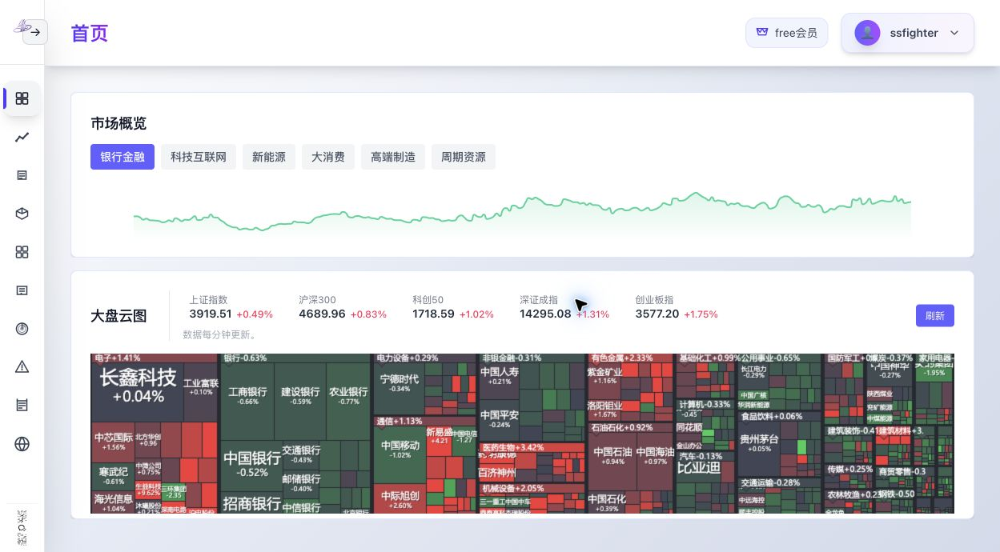

首页是"市场仪表盘"，由两大块组成：

### 2.1 市场概览

- 顶部是 **6 个主题板块切换按钮**：银行金融、科技互联网、新能源、大消费、高端制造、周期资源。
- 中部是该板块的 **K 线走势图**，支持 1 个月 / 3 个月 / 1 年 / 5 年 / 全部 共 5 个时间周期切换。
- 下方是板块内 **代表个股卡片列表**：显示股票名称、代码、最新价、涨跌幅（红涨绿跌），例如宁波银行 002142、邮储银行 601658 等。

### 2.2 大盘云图

- 展示 5 个核心指数的实时点位和涨跌幅：上证指数、沪深300、科创50、深证成指、创业板指。
- 标注"数据每分钟更新"，并提供手动"刷新"按钮。
- 下方内嵌一个第三方的"大盘云图"页面（以 iframe 方式嵌入，即把别的网页嵌进来）。

**名词解释：iframe** 在一个网页里嵌套显示另一个网页的技术，像"画中画"。

---

## 3. 股票分析（核心模块）

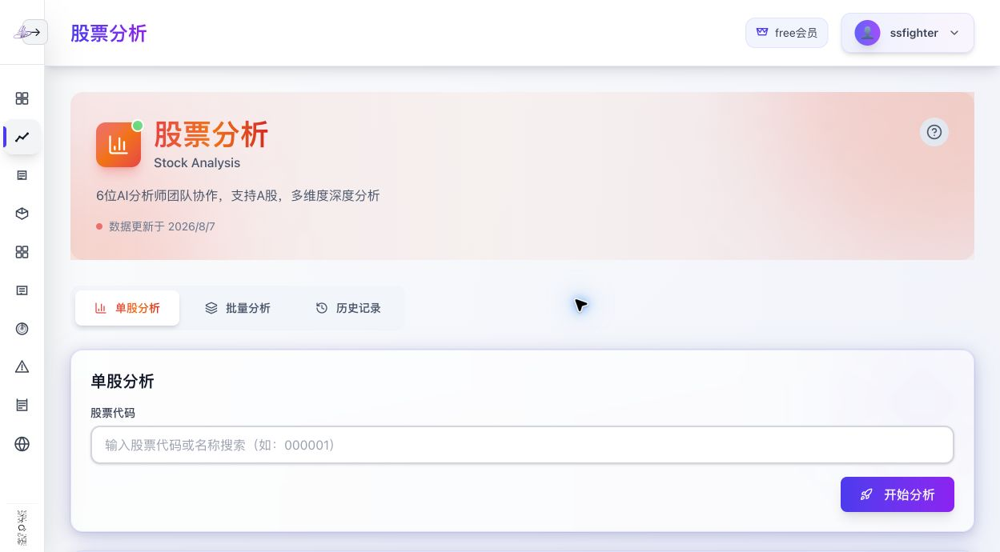

这是整个系统最核心的功能，页面副标题写着"6位AI分析师团队协作，支持A股，多维度深度分析"。

### 3.1 三个子标签页

1. **单股分析**：输入股票代码 → 点"开始分析" → 等待几分钟后出完整报告。
2. **批量分析**：输入最多 50 只股票代码（逗号或换行分隔），一次性批量分析。
3. **历史记录**：保存每一次分析结果（股票、分析日期、评级、置信度、创建时间），可随时"查看详情"回看。

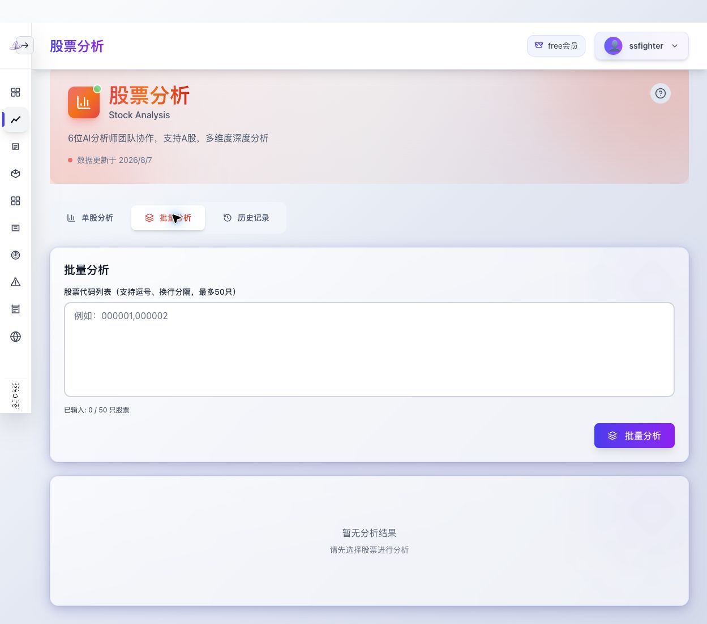
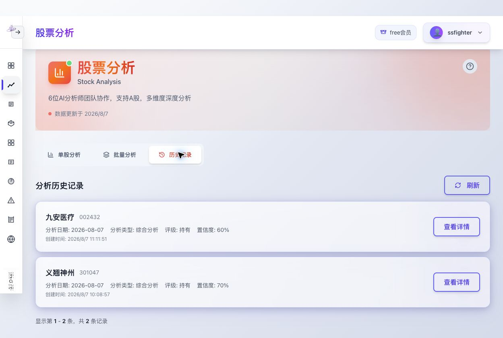

### 3.2 股票基础数据区

分析报告顶部先给出行情快照：当前价格、涨跌幅、市盈率 TTM、市净率、市值、所属行业，以及一张股价走势图。

### 3.3 技术指标面板

自动计算并展示 5 组常用技术指标：

| 指标 | 展示内容 |
|---|---|
| 移动平均线 MA | MA5 / MA20 / MA60 |
| MACD | DIF / DEA / MACD 柱值 |
| RSI 相对强弱 | RSI(14) 数值 + 超卖线(30)/超买线(70) |
| KDJ 随机指标 | K 值 / D 值 / J 值 |
| 布林带 BOLL | 上轨 / 中轨 / 下轨 |

**名词解释：** 这些都是股民常用的技术分析指标，用历史价格和成交量按固定公式算出来的数字，用来判断趋势和买卖点。系统的好处是不需要用户懂公式，AI 会直接把数字"翻译"成人话。

### 3.4 AI 分析师报告（6 位分析师）

每位 AI 分析师输出一份结构一致的报告，包括：核心结论表、评分（百分制或十分制）、操作建议、以及大段自然语言的详细解读。实测一次完整分析包含：

1. **技术面分析师**：整体趋势判断（如"横盘箱体震荡"）、技术评分（如 62/100）、短中长期趋势表、支撑位/阻力位分析表、突破概率估算（如"向上突破概率约 55%"）、各技术指标逐一解读、价格形态识别。
2. **基本面分析师**：财务健康度、盈利能力、估值水平，基本面评分（如 5.5/10）。
3. **资金面分析师**：主力资金近 20 日净流入/流出、超大单/大单/散户（小单）动向拆解，资金评分（如 4/10）。
4. **新闻分析师**：抓取该股票近期新闻和公告，给出"新闻综合评级"（如"中性偏利空"）。
5. **市场情绪分析师**：ARBR 指标、换手率、大盘恐慌贪婪指数（如 79.2 分"极度贪婪"）、涨跌家数比等，情绪评分（如 79.2/100）。
6. **风险管理 / 综合决策角色**：汇总前面所有分析师意见，输出综合风险等级（如"中等风险"、风险评分 6.5/10）和风险控制建议。

### 3.5 "AI 投研会议"与最终决策

最有特色的部分：6 位分析师分析完后，系统会生成一份模拟"投研会议"的记录——先给会议总结，然后给出**最终决策卡片**：

- 最终决策：买入 / 持有 / 卖出（实测为"持有"）
- 投资评级、目标价格（¥82.18）、止损价格（¥68.50）、决策置信度（60%）
- 交易策略：操作建议正文、入场区间（69.50-70.50）、止盈目标、持有期限（1-3个月）、仓位建议（不超过 15%）、风险提示
- 关键观察指标清单：把技术面/资金面/基本面/情绪面后续要盯的信号逐条列出来

底部有"**导出PDF报告**"按钮，可以把整份报告下载成 PDF（会员权益之一）。

每份报告末尾固定带免责声明："本分析仅供参考，不构成任何投资建议。"

---

## 4. 主力选股

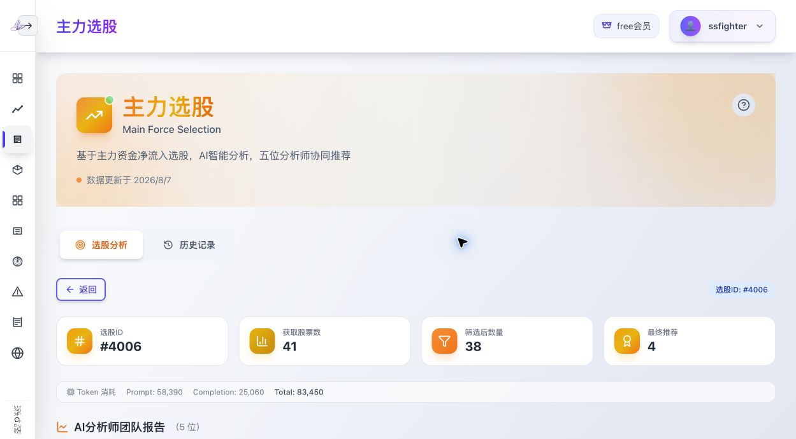

副标题："基于主力资金净流入选股，AI智能分析，五位分析师协同推荐"。

### 工作流程（页面上直接可见）

每次选股生成一个"选股ID"（如 #4006），并展示漏斗式的筛选过程：

- 获取股票数：41 只（按主力资金净流入初筛）
- 筛选后数量：38 只
- 最终推荐：4 只
- **Token 消耗**：Prompt 58,390 + Completion 25,060 = 83,450（即这次 AI 分析用了多少大模型"字数额度"，让用户直观看到成本）

### 5 位 AI 分析师 + 1 位资深研究员

页面上以卡片形式展示每位分析师的角色和处理状态（成功/失败）：

1. 资金流向分析师 —— 分析主力资金流向、板块集中度、资金与价格配合度
2. 行业板块分析师 —— 分析板块热点、持续性、新兴机会
3. 财务基本面分析师 —— 分析财务健康度、盈利能力、估值水平
4. 技术形态分析师 —— 识别 K 线形态、均线系统、技术指标信号
5. 量化分析师 —— 量化信号、统计特征、量价关系、龙虎榜异动
6. **资深研究员** —— 综合四位分析师意见，精选最优标的（最终拍板的角色）

### 精选推荐

输出"优先推荐"股票清单，附"推荐分层说明"。实测报告里能看到系统的选股逻辑非常具体：以 `strategy_fit.passed=True` 为硬性门槛、用股东户数变化判断筹码集中度（如"股东户数减少 18.5% 为真吸筹"）、排除筹码分散的标的，并给出被排除股票的原因。

另有"**历史记录**"标签页保存历次选股结果。

---

## 5. 智策板块

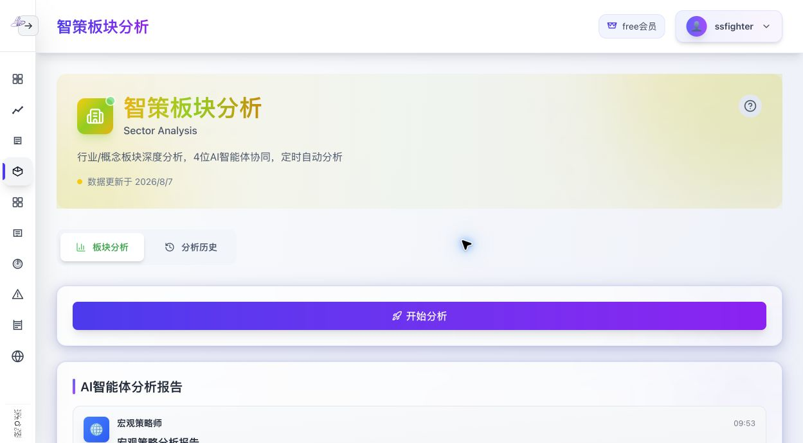

副标题："行业/概念板块深度分析，4位AI智能体协同，定时自动分析"。

### 4 位 AI 智能体

1. 🌐 宏观策略师 —— 宏观策略分析报告
2. 📊 板块诊断师 —— 申万二级行业板块诊断报告
3. 💰 资金流向分析师 —— 板块资金流向深度分析报告
4. 📈 市场情绪解码员 —— 市场情绪分析报告

每位智能体的报告可以"展开查看完整分析"。**"定时自动分析"**意味着不需要用户点击，系统每天到点自己跑一遍。

**名词解释：申万行业分类** 申银万国证券制定的行业分类标准，是国内机构最常用的行业划分方式（如"煤炭开采""消费电子"都是申万二级行业名）。

### 板块多空预测

核心产出物：

- **看多板块列表**：每个板块给出置信度（如 9/10）、看多逻辑（一段话）、风险提示。
- **看空板块列表**：同样结构（实测报告中有"等待更好介入点"等表述）。
- **操作节奏建议**：短期（1-2周）/中期（1-3个月）分别怎么调仓。
- **风险触发条件**：如"上证指数放量跌破 3850 点则仓位降至五成以下"。
- **核心跟踪指标**：后续要盯的信号清单。

另有"**分析历史**"标签页。

---

## 6. 智瞰龙虎榜

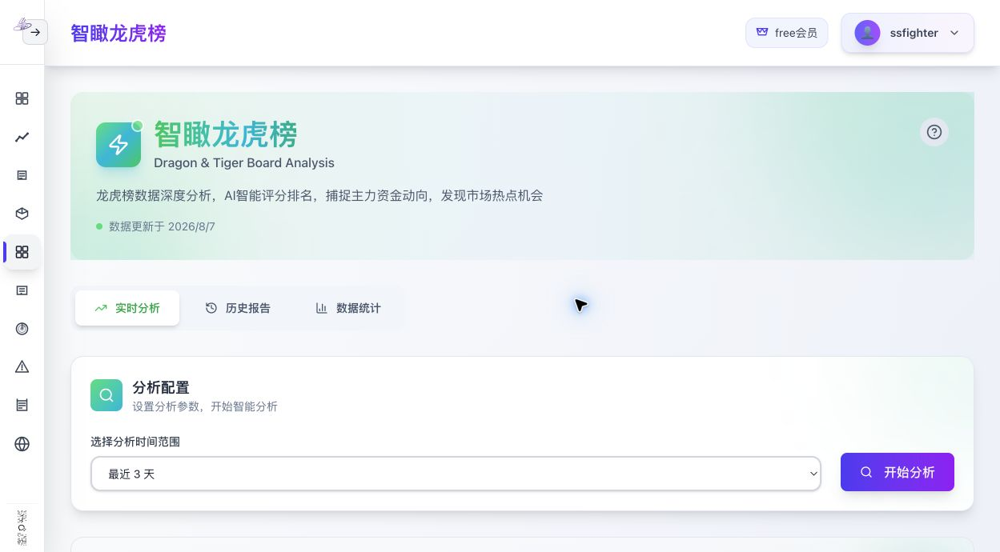

副标题："龙虎榜数据深度分析，AI智能评分排名，捕捉主力资金动向，发现市场热点机会"。

**名词解释：龙虎榜** 交易所每天收盘后公布的"异动股票榜单"——涨跌幅、换手率等异常的股票会被披露买卖金额最大的前 5 个营业部（俗称"游资席位"）。股民用它追踪主力和游资的动向。

### 功能结构

- **分析配置**：选择分析时间范围（最近 3/5/10/15/20/30 天）→ 点"开始分析"。
- **AI 分析摘要**：共分析 269 条龙虎榜记录、上榜股票数 196、总净流入 83.04 亿、活跃游资数 255、信心评分 99.8。
- **数据摘要**：总记录数、唯一股票数、唯一游资数、平均净流入、风险等级（如"高风险"）、数据范围（2026-08-04 至 2026-08-06）。
- **龙虎榜推荐股票**：Top 10 表格，列为：排名、股票、综合评分（如 73 分 B 级）、净流入金额（买/卖拆分）、游资情况（如"1家机构买入，成功率43.42%"）、上榜类型（如"日涨幅偏离值达到7%的前5只证券"）、日期。
- **AI 策略建议**（实测报告尾部）：仓位管理纪律（如"单笔亏损 5% 无条件止损"）、情绪退潮信号、T+1 数据滞后陷阱提醒、规避无名称/可转债标的等。

另有"**历史报告**"和"**数据统计**"标签页。

---

## 7. 持仓分析

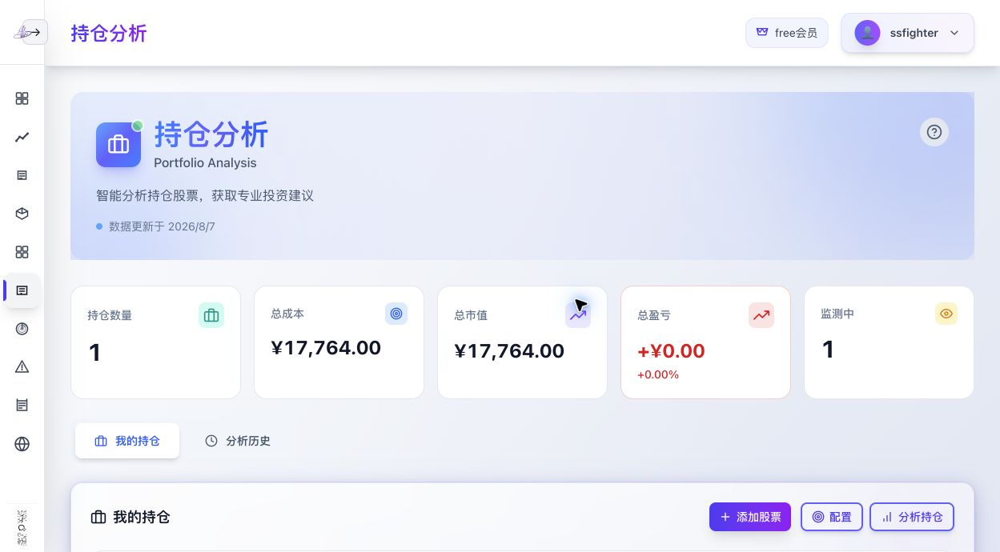

副标题："智能分析持仓股票，获取专业投资建议"。

### 7.1 持仓管理

- 顶部统计卡片：持仓数量、总成本、总市值、总盈亏（金额 + 百分比）、监测中数量。
- "添加股票"录入：股票代码、名称、持仓数量、成本价。
- 持仓表格：每行一只股票，支持**自动监控开关**（与"实时监测"模块联动）、编辑、删除。
- "配置"和"分析持仓"按钮。

### 7.2 组合诊断（AI 输出）

点"分析持仓"后生成：

- **健康评分**（如 45 分）
- **风险评估**（如"高风险。组合仅持有1只股票，行业集中度极高……"）
- 诊断摘要四段式：资产配置点评、风险暴露分析、策略一致性检查（很细致：会把个股评级和实际仓位做逻辑对照，指出"持有评级但满仓集中"的矛盾）、总体建议
- **投资建议**：编号列表（如"逐步减持至 30% 以下""分散到 2-3 个行业""设定 10% 止损线""每月复盘"）

另有"**分析历史**"标签页和"清除结果"按钮。

---

## 8. 实时监测

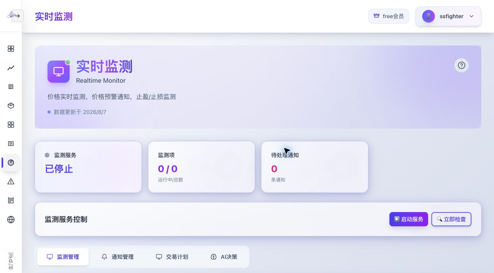

副标题："价格实时监测，价格预警通知，止盈/止损监测"。

### 8.1 监测服务总控

- 三个状态卡片：监测服务（运行中/已停止）、监测项（运行中/总数）、待处理通知数。
- 服务控制按钮："▶️ 启动服务" / "🔍 立即检查"。

### 8.2 四个子标签页

1. **监测管理**：监测列表（+ 添加监测），可按状态过滤（全部/运行中/已停止）。监测类型围绕价格预警、止盈止损。
2. **通知管理**：待处理通知 / 已处理通知两个列表。
3. **交易计划**：AI 交易计划列表（AI 盯盘生成的买卖计划）。
4. **AI决策**：AI 决策记录列表。

实测该账号下监测项为空（免费会员此功能需付费解锁），页面呈现了完整的空状态设计。

---

## 9. 风险预警

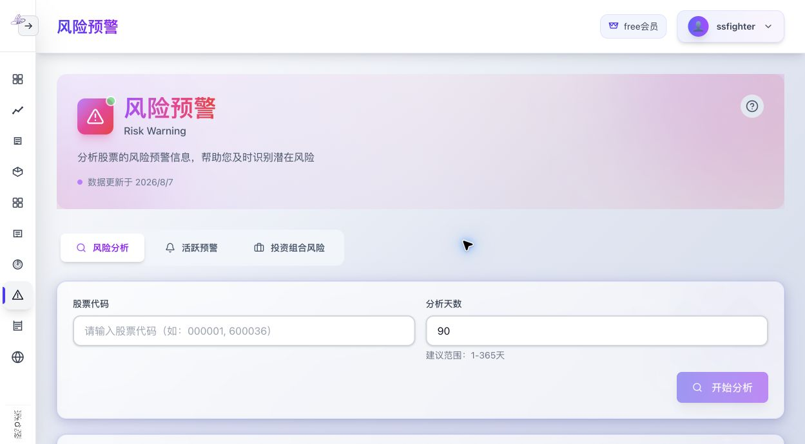

副标题："分析股票的风险预警信息，帮助您及时识别潜在风险"。

### 三个子标签页

1. **风险分析**：输入股票代码 + 分析天数（建议 1-365 天）→ 开始分析。
2. **活跃预警**：可按股票代码、预警级别（信息/警告/危险/严重）筛选。实测返回"权限不足，需要管理员权限"——说明全市场级别的预警中心是管理员功能，普通用户只能用自己组合的预警。
3. **投资组合风险**：对自己持仓做综合风险扫描，输出：
   - 预警总数（3）、最高风险等级（警告）、综合风险评分（56.00）
   - 预警级别统计（警告 2 条、信息 1 条）
   - 预警列表：每条含级别、类型（价格波动/技术信号）、股票代码、说明（如"RSI超卖(22.2)""价格处于近期高位，注意回调风险"）、日期

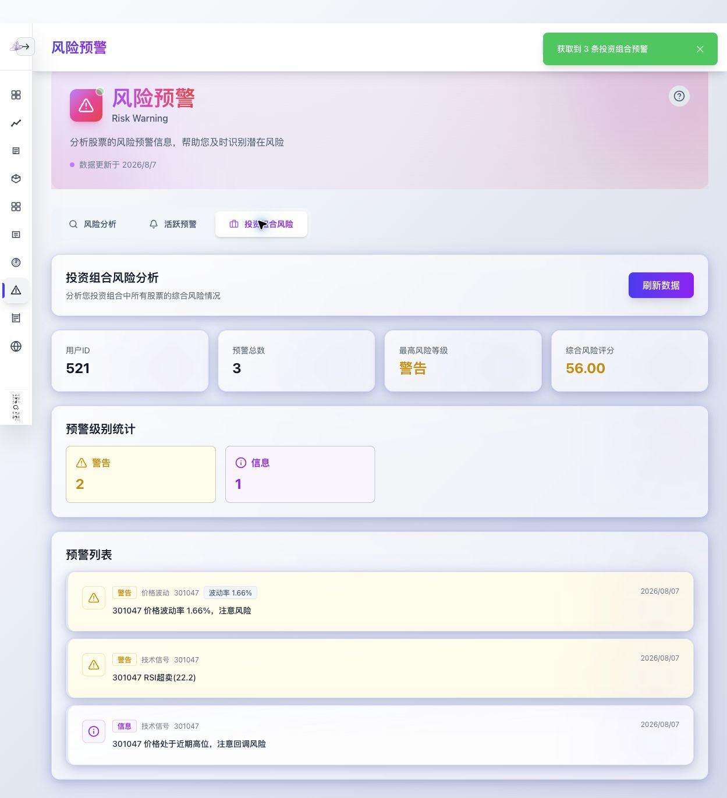

---

## 10. 实时新闻

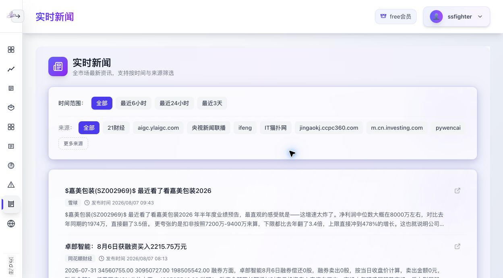

副标题："全市场最新资讯，支持按时间与来源筛选"。

- **时间筛选**：全部 / 最近6小时 / 最近24小时 / 最近3天。
- **来源筛选**：全部，或单独来源。实测来源非常多：雪球、同花顺财经、新浪财经、21财经、央视新闻联播、ifeng（凤凰网）、IT猫扑网、investing.com 中文站、pywencai（问财）等十几个。
- **新闻流**：每条新闻卡片含标题、来源、发布时间、摘要；重点新闻还带 **AI 标注**：分类（如"综合"）、**利好/利空判断**、相关行业（如"通用设备"）。

这个模块的价值不只是聚合，而是 AI 提前把每条新闻"读过一遍"并打上情绪标签，用户一眼就能看出哪条是利好。

---

## 11. 美股隔夜研报

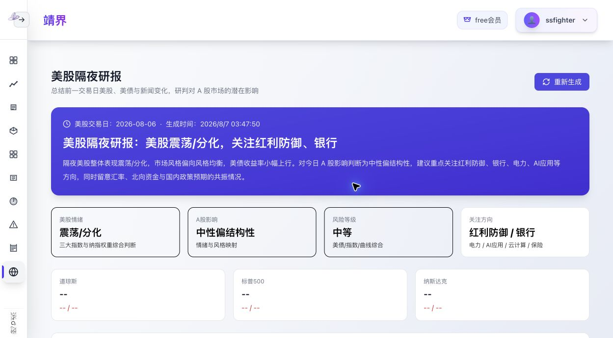

副标题："总结前一交易日美股、美债与新闻变化，研判对 A 股市场的潜在影响"。

### 内容结构（每天凌晨自动生成，实测生成时间为 03:47）

- 研报头：美股交易日（2026-08-06）、生成时间、"重新生成"按钮。
- **四个判断卡片**：美股情绪（震荡/分化）、A股影响（中性偏结构性）、风险等级（中等）、关注方向（红利防御/银行/电力/AI应用等）。
- **三大指数**：道琼斯、标普500、纳斯达克（收盘点位、涨跌幅）。
- 正文章节：核心结论、隔夜美股市场表现等。
- **核心美股个股表**：英伟达、苹果、微软、特斯拉、AMD、谷歌、Meta、亚马逊——每只个股标注涨跌幅和"**A股映射方向**"（如英伟达 → AI算力/CPO/液冷/服务器），这是把美股动向翻译成 A 股板块机会的关键设计。
- 涨幅榜 Top 5 / 跌幅榜 Top 5（带代码、价格、涨跌幅）。
- 板块样本（Financial Services 1785 家、Healthcare 1350 家等）。
- **美债收益率**：2 年 / 10 年 / 30 年期收益率。
- 重要新闻列表（英文原文）。
- **数据源状态诊断**：可展开查看各数据源是否正常（对运维很友好）。

代码里还存在 `/us-research/rankings`、`/us-research/sectors`、`/us-research/treasury` 三个子路由，对应涨幅榜、板块、美债的独立页面。

---

## 12. 会员体系与充值中心

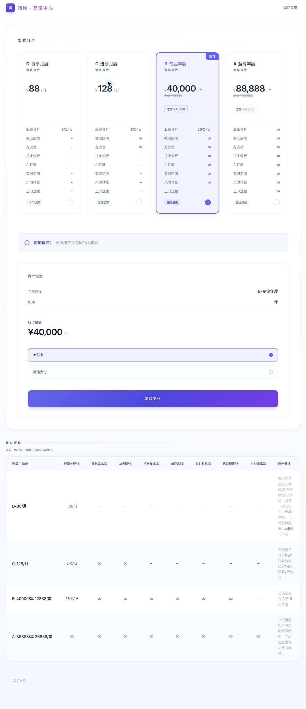

系统采用"功能配额制"会员收费。四档付费套餐 + 免费版：

| 套餐 | 价格 | 股票分析 | 智策板块 | 龙虎榜 | 持仓分析 | AI盯盘 | 实时监测 | 风险预警 | 主力选股 |
|---|---|---|---|---|---|---|---|---|---|
| free 免费版 | 0 | 有限次体验 | - | - | - | - | - | - | - |
| D-尊享月度 | ¥88/月 | 5次/日 | - | - | - | - | - | - | - |
| C-进阶月度 | ¥128/月 | 8次/日 | ∞ | ∞ | - | - | - | - | - |
| B-专业年度 | ¥40,000/年（季付 ¥12,888） | 20次/日 | ∞ | ∞ | ∞ | ∞ | ∞ | ∞ | - |
| A-至尊年度 | ¥88,888/年（季付 ¥26,888） | ∞ | ∞ | ∞ | ∞ | ∞ | ∞ | ∞ | ∞ |

- "∞" 表示不限次；"-" 表示不可用。
- 每档有充值赠送权益（如"充值送主力选股15天体验"）。
- 支付方式：**支付宝、微信支付**。
- 页面还有"资产配置"结算区（当前选择套餐、周期、应付金额）和完整的"权益矩阵"对照表。
- 后端接口印证：`/api/subscription/plans`、`/api/subscription/subscribe`、`/api/subscription/status`、`/api/subscription/usage`（用量统计）、`/api/subscription/cancel`。

---

## 13. 个人中心

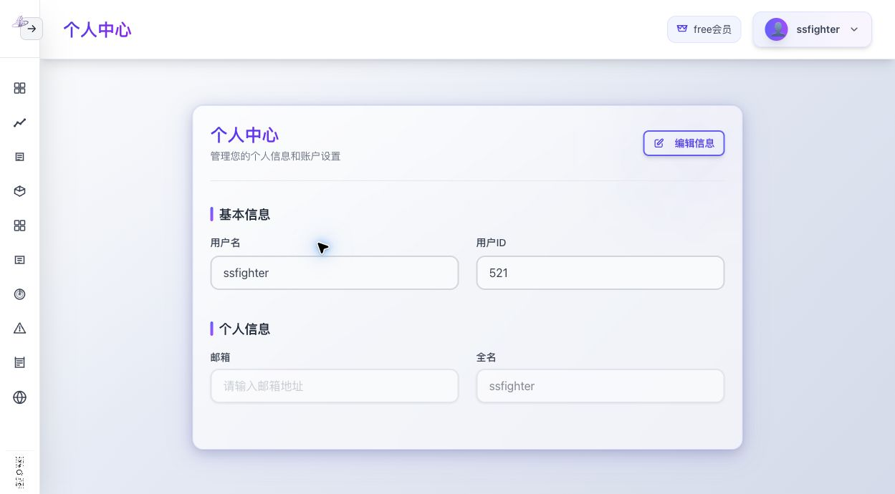

- 显示用户名、用户ID（数字，如 521）、邮箱、全名。
- "编辑信息"按钮修改资料。

## 14. 其他辅助功能

- **联系客服**：左侧边栏底部，悬停显示客服二维码（微信）。
- **公告系统**：后端有 `/api/announcements` 系列接口（最新公告、分类、详情），用于站内公告。
- **意见反馈**：`/api/feedback` 接口，用于用户提交反馈。
- **数据更新标识**：每个功能页顶部都显示"数据更新于 2026/8/7"。

---

## 15. 功能-技术对照速查（给开发用）

| 功能 | 背后需要的数据/能力 |
|---|---|
| 首页行情、K线 | A 股实时/历史行情数据源（分钟级更新） |
| 技术指标面板 | 历史行情 + 指标计算库（MA/MACD/RSI/KDJ/BOLL） |
| 股票分析 6 分析师 | 行情、财务数据、资金流向、新闻舆情 + 大语言模型（LLM）多轮调用 |
| 主力选股 | 全市场资金流向排行、股东户数变化 + LLM |
| 智策板块 | 申万行业分类、板块行情/资金流 + LLM + 定时任务 |
| 龙虎榜 | 龙虎榜历史数据 + LLM |
| 持仓分析 | 用户持仓存储 + 实时行情 + LLM |
| 实时监测 | 分钟级行情轮询 + 通知系统 + 定时任务 |
| 风险预警 | 波动率、RSI 等指标规则引擎 + LLM |
| 实时新闻 | 多来源资讯采集（RSS/爬虫）+ LLM 情绪标注 |
| 美股隔夜研报 | 美股行情、美债收益率、英文财经新闻 + LLM + 定时任务 |
| 会员充值 | 支付宝/微信支付接口、订单与配额系统 |
| 注册登录 | 邮箱验证码服务、密码加密存储 |

> 注：本系统所有 AI 输出均带"不构成投资建议"免责声明。我们复刻时同样必须保留，且面向公众收费提供荐股类服务涉及合规问题，详见 PRD 文档的风险章节。
